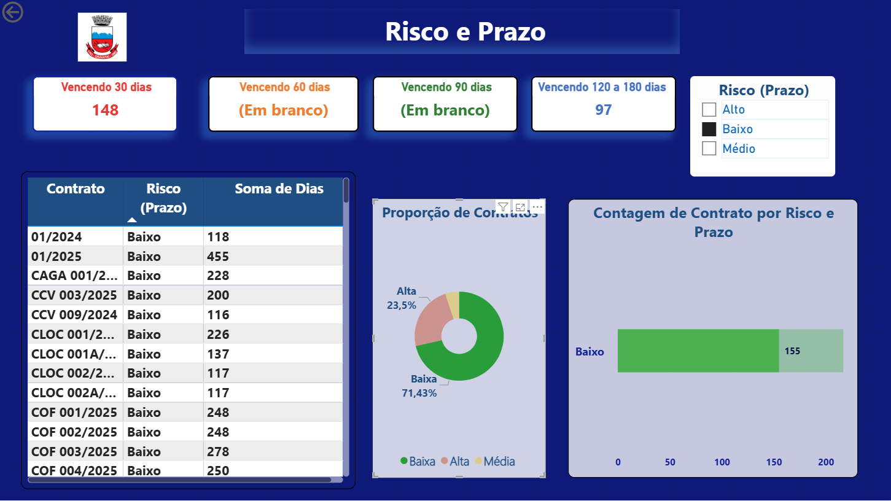

# Gestão de Contratos — Prefeitura de Gravataí  

📌 Projeto desenvolvido por **Luana Ferreira de Sousa**  

📊 **Objetivo:** Criar um painel em Power BI para acompanhar contratos, priorizar prazos críticos e visualizar os níveis de automação.  

---

## 🔹 Destaques  
- KPIs de vencimento (30, 60, 90, 120 dias).  
- Matriz de criticidade (baixo, médio, alto).  
- Gráficos de rosca e barras para visualização clara.  
- Página 2 com **visão de automação de contratos**.  
- Layout organizado com foco em **storytelling**.  

---

## 🛠 Ferramentas utilizadas  
- Power BI  
- Excel  
- Data Storytelling  

---  
## 🖼 Exemplos Visuais  

**Capa**  
  

**Página 1 — Prazos e Criticidade**  
  

**Página 2 — Automação**  
  

"Adicionando imagens ao README do Projeto Gravataí"
---

✨ *Este projeto faz parte do portfólio de dados de **Luana Ferreira de Sousa**.*
