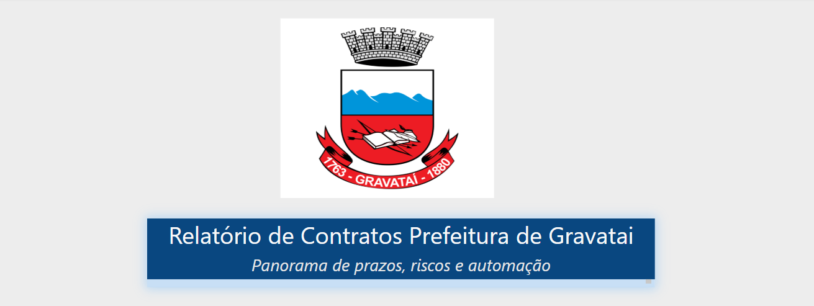
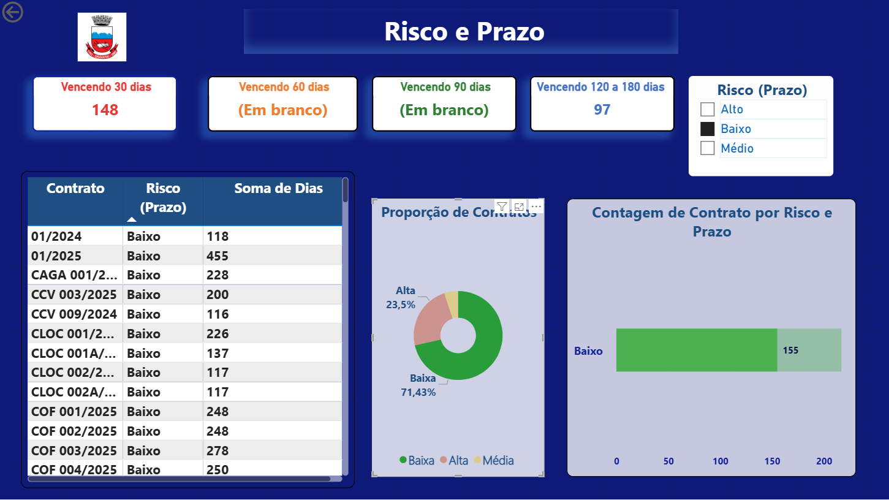
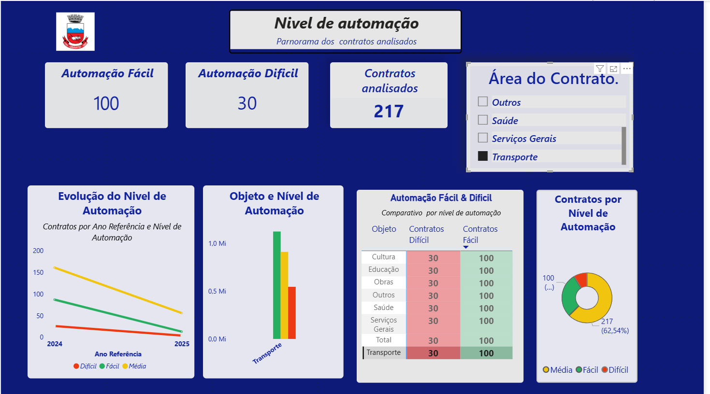

# Portifolio-Dados
Portfólio de projetos em Análise de Dados e Business Intelligence, com foco em Power BI, Excel, Python, SQL, Tableau, Looker Studio, Figma, Storytelling e Kanban. Transformando dados em insights visuais e estratégicos para apoiar decisões.

---
## 📌 Exemplos Visuais

 **Capa do Projeto**    
Imagem de abertura com identidade visual da Prefeitura de Gravataí.  

# Gestão de Contratos — Prefeitura de Gravataí

## 🔎 Sobre o Projeto  
Este dashboard foi desenvolvido no **Power BI** para apoiar a gestão de contratos da **Prefeitura de Gravataí**.  
O objetivo é oferecer uma visão clara e prática sobre:  
- **Prazos críticos** dos contratos (com alertas visuais para vencimentos próximos).  
- **Distribuição por criticidade** (baixo, médio e alto risco).  
- **Níveis de automação** dos processos, destacando contratos de automação fácil e difícil.  
- **Proporções e evolução** da automação, permitindo identificar oportunidades de melhoria.  

O projeto segue boas práticas de **data storytelling**, trazendo não apenas indicadores, mas também insights visuais para apoiar a tomada de decisão.  

---

## 📊 Página 1 — Contratos  
Visão geral dos contratos, prazos críticos e distribuição por criticidade.  
  

**Principais recursos:**  
- KPIs de contratos com vencimento em diferentes prazos (30, 60, 90 e 120 dias).  
- Matriz com detalhamento de cada contrato (número, valor e prazo).  
- Gráfico de proporção por nível de risco.  

---

## ⚙️ Página 2 — Automação  
Análise da automação dos contratos, destacando níveis, evolução e proporções.  
  

**Principais recursos:**  
- Indicadores de contratos classificados como **Automação Fácil** ou **Automação Difícil**.  
- Evolução do nível de automação ao longo do tempo.  
- Comparativo por objeto e por área de contrato.  
- Gráfico de proporção e mapa visual de automação.  

---

## 📌 Rodapé  
🔗 [LinkedIn — Luana Ferreira de Sousa](https://www.linkedin.com/in/luaferreira-desousa)  

---    

### 2) Dashboard de Vendas (Power BI) — *em construção*
📁 [Abrir pasta do projeto](Dashboard-Vendas)

### 3) Consultas SQL — análise exploratória
📁 [Abrir pasta do projeto](SQL-Consultas)

---🌟 *Este projeto faz parte do portfólio de dados de* **Luana Ferreira de Sousa** 🌟  

🔗 [Acompanhe meu perfil no LinkedIn](https://www.linkedin.com/in/luaferrreira-desousa) 

## 🧰 Habilidades
**Power BI** (DAX básico, KPIs, layouts) • **SQL** (consultas e filtros) •  
**Excel** (Power Query, dashboards) • **Python (iniciante)** •  
**LGPD** • **Kanban / Target Process**

---
## 📂 Estrutura do repositório
/Projeto-Gravatai
/Projeto-Gravatai/README.md
/Projeto-Gravatai/capa-gravatai.png
/Dashboard-Vendas
/SQL-Consultas

