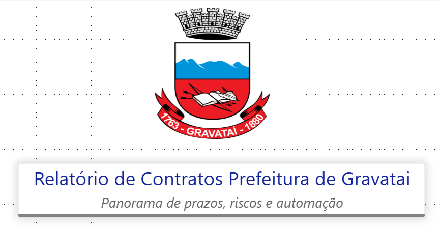
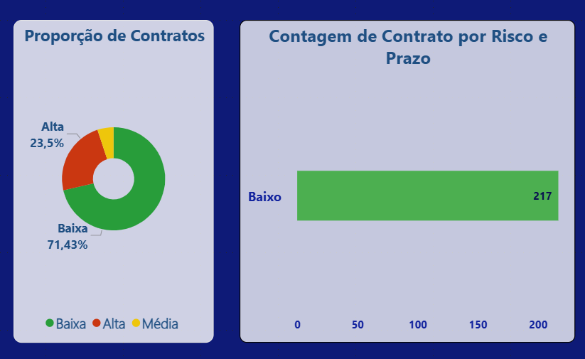

# Portifolio-Dados
Portfólio de projetos em Análise de Dados e Business Intelligence, com foco em Power BI, Excel, Python, SQL, Tableau, Looker Studio, Figma, Storytelling e Kanban. Transformando dados em insights visuais e estratégicos para apoiar decisões.
# 📊 Portfólio de Dados — Luana Ferreira de Sousa

Transformo dados em decisões claras. Crio dashboards e análises com **Power BI, SQL, Excel e Python**, aplicando **storytelling** e foco no negócio.

---

1) Gestão de Contratos — Prefeitura de Gravataí (Power BI)

📊 Painel em Power BI para acompanhar prazos críticos de contratos e mensurar automação.  

**Ferramentas:** Power BI, Excel, Data Storytelling.  

📂 [Abrir documentação completa](Projeto-Gravatai/LEIA-ME.md)  

---

### 📌 Exemplos Visuais

**Capa do Projeto**  

**Página 1 – Contratos**  
- **KPIs de Contratos e Filtros**  
    
  *Indicadores de prazos críticos (30, 60, 90 e 120 dias) e filtro de criticidade.*  

- **Proporção e Contagem de Contratos**  
    
  *Distribuição dos contratos por nível de criticidade e contagem geral.*  

**Página 2 – Automação**  
- **KPIs de Automação e Filtros**  
    
  *Resumo dos contratos classificados por nível de automação (fácil ou difícil).*  

- **Evolução por Objeto de Automação**  
    
  *Comparativo da evolução dos contratos ao longo do tempo, segmentados por objeto.*  

- **Matriz de Automação e Proporção**  
    
  *Relação entre o objeto dos contratos e o nível de automação, destacando proporções e áreas estratégicas.*  

### 2) Dashboard de Vendas (Power BI) — *em construção*
📁 [Abrir pasta do projeto](Dashboard-Vendas)

### 3) Consultas SQL — análise exploratória
📁 [Abrir pasta do projeto](SQL-Consultas)

---

## 🧰 Habilidades
**Power BI** (DAX básico, KPIs, layouts) • **SQL** (consultas e filtros) •  
**Excel** (Power Query, dashboards) • **Python (iniciante)** •  
**LGPD** • **Kanban / Target Process**

---
## 📂 Estrutura do repositório
/Projeto-Gravatai
/Projeto-Gravatai/README.md
/Projeto-Gravatai/capa-gravatai.png
/Dashboard-Vendas
/SQL-Consultas

